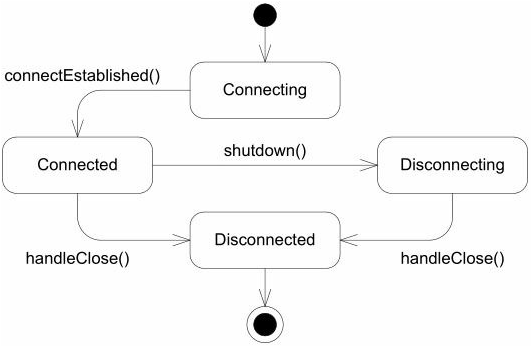
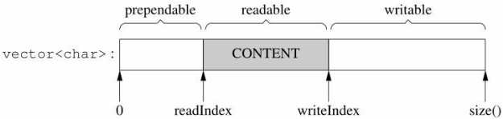

# 项目设计与技术点

[toc]

## 线程/线程池


线程池为避免频繁创建、销毁线程，提供一组子线程，能从工作队列取任务、执行任务，而用户可以向工作队列加入任务，从而完成用户任务，主要文件包括（不同于 EventLoopThread）：

- [Thread](mymuduo/base/Thread.h)
- [ThreadPool](mymuduo/base/ThreadPool.h)

主要步骤如下：

1) 创建一组线程，每个线程为一个loop循环；
2) 有任务需要执行时，入队列；
3) 当有线程池中有线程空闲时，从队列中取出任务执行回调；

## 日志

> 这部分完全采用了 muduo 的实现

### 设计


采用双缓冲区（double buffering）交互技术。基本思想是准备2部分buffer：A和B，前端（front end）线程往buffer A填入数据（日志消息），后端（back end）线程负责将buffer B写入日志文件。当A写满时，交换A和B。

- AsyncLogging 类主要功能就是提供后端线程，定时将日志缓冲写到磁盘，维护缓冲及缓冲队列；
- LogFile 提供对日志文件的操作，包括滚动日志文件、将log数据写到当前log文件、flush log数据到当前log文件；
- Logger （在 Logging.h 中）功能：为用户（前端线程）提供使用日志库的接口，是一个pointer to impl的实现（即GoF 桥接模式）；
- LogStream 提供 operator<< 格式化用户正文内容，将其转换为字符串，并添加到Small Buffer（4KB）末尾；

日志库的主要实现流程：

1. Logger 提供用户接口，将实现细节隐藏到Impl，Logger定义一组宏定义LOG_XXX方便用户在前端使用日志库；
2. Impl完成一条完整log消息的组装；
3. LogStream提供operator<< 格式化用户正文内容，将其转换为字符串，并添加到Small Buffer（4KB）末尾；
4. AsyncLogging 提供多个Large Buffer缓存多条log消息，从而减少写文件频率，前端需要在重新配接输出位置后，将每条log消息输出到Large Buffer中。后端线程也是由AsyncLogging 负责维护，负责异步写入文件；
5. LogFile 提供日志文件操作，包括滚动日志文件、写日志文件；
6. AppendFile 封装了最底层的的写文件操作，供LogFile使用；

### LogStream

muduo没有用到标准库的iostream，而是自己写的LogStream类，这主要是出于性能。
设计这个LogStream类，让它如同C++的标准输出流对象cout，能用<<符号接收输入，cout是输出到终端，而LogStream类是把输出保存自己内部的缓冲区，可以让外部程序把缓冲区的内容重定向输出到不同的目标，如文件、终端、socket等。
LogStream类本本身不是线程安全的，正确使用方式是每个log消息构造一个LogStream，用完就扔。由于其成本极低，这么做是没有什么性能损失的。

其中，成员变量Buffer是FixedBuffer<>模板类的实例化对象，过成员 data_首地址、cur_指针、end()完成对缓冲区的各项操作。通过.append()接口把日志内容添加到缓冲区来：

FixedBuffer维护一块栈上长度为SIZE的内存区域，写入length()长度的后，剩余avail()空间。 指针curr_指向下一次.append()可写入数据的位置。

### AsyncLogging

AsyncLogging是muduo的日志，程序如果直接让文件写日志可能会发生阻塞，所以有了异步日志这一说。muduo前端设计了2个BufferPtr，分别是currentBuffer_和nextBuffer_，还有一个存放BufferPtr的vector(buffers_)。
多个前端线程往currentBuffer_写数据，currentBuffer_写满了将其放入buffers_，通知后端线程读。前端线程将currentBuffer_和nextBuffer_替换继续写currentBuffer_。
后端也有2个BufferPtr，分别为newBuffer1和newBuffer2，还有一个BufferVector(buffersToWrite)。后端线程在收到前端通知之后，利用buffersToWrite和buffers_进行交换，并且用newBuffer1和newBuffer2归还给前端的currentBuffer_和nextBuffer_，然后把日志写入文件。

## Net 基本类

### EventLoop

EventLoop 的作用就是在一个线程中一直loop，用 poller 来等待 io 事件，一个线程中只能存在一个 EventLoop，这一点会使用 __thread 来保证每个线程独有的变量。这个类在构造时会通过 CurrentThread 中的辅助函数来记住当前内核线程id。

EventLoop 持有 poller，这通过 scope_ptr 来实现不可转让，也就是唯一指针，这也很好理解，因为 poller - EventLoop - Thread 都是一一对应关系。

EventLoop 直接持有 Channel*，Poller 中只存储了 fd 和 Channel* 的对应关系，因此当需要删除一个 Channel时，通过 EventLoop 删除，并在 Poller中取消注册。

EventLoop 在loop中会通过 Poller 的函数来间接调用 poll 和 epoll，当poller检测到事件，对于poll和epoll分别进行不同的处理，比如说对于epoll，通过epoll_wait 来讲，他会获取所有的活动事件，然后填充到调用方传入的 activeChannels，这样就可以在 loop 中对每个 Channel遍历其 revents 并调用对应的回调函数，这通过调用 Channel->handleEvent 来处理。


除此之外，EventLoop 中还维护了一个 wakeupfd，用于由其他线程来调用该 EventLoop->quit，如果此时正在挂起并等待io时间，就直接在 wakeupfd上写入数据，这时就会触发 poller 进行处理，也就达到了唤醒该线程的作用。

EventLoop 实现了一个功能 queueInLoop，就是它维护了一个任务队列，队列中是必须在 EventLoop 所在线程中执行的函数，为了实现这个功能，就用到了上述的 wakeup。当EventLoop 阻塞在io复用中或者是正在执行任务队列中的函数时就向 wakeupfd 写入，保证 EventLoop 能立马被唤醒或者是在下一次 loop 中立马唤醒。EventLoop 在每一次loop中都会检查工作队列并依次执行。

### Channel

Channel 封装了对 fd的感兴趣事件、实际发生的事件（由poller填写）、不同事件的回调函数。它会记录自己所对应的fd，但是并不负责该 fd的打开与关闭。

Channel 对用户提供的接口基本上只是 开启、关闭事件，设置回调函数等。

### Poller

Poller 则封装了 IO 多路复用的调用细节，总共实现了 pollpoller 和 epollpoller 两种，poll 的话主要就是每次只返回有活动的fd数量，然后需要遍历 poller中缓存的所有 struct pollfd 来检测哪个fd触发了事件，并且这些结构体是通过 poller->updateChannel 来进行修改的。epoll 使用过 epoll_create 创建一个唯一的 epollfd描述符，内核会自动维护该事件表，然后使用 epoll_ctl 来添加、删除、修改一个fd上监听的事件，当调用 epoll_wait 时可以直接返回发生了活动的 epoll_event 链表，然后遍历该列表进行处理即可。

当我们开启/关闭了 Channel 中fd上的某些事件，就有如下调用 Channel->update |   EventLoop->updateChannel  |  Poller->updateChannel，然后 poll 和 epoll 分别会有不同的处理（poll 内部维护了 pollfd 数组，epoll则通过 Ctl 函数通知内核进行修改）。

### Timer

TimerId 是定时器的唯一标识，也是唯一暴露给用户的接口（用于cancel），它主要存储了 Timer 指针和全局递增的唯一标识号。因为Timer指向的地址可能会被复用，使得两个Timer指向相同位置（Timer的删除是延时的，可能同时存在两个地址相同的Timer）。

Timer 存储一个定时器时间的全部信息，包括到期时间、是否重复执行、间隔时间、回调函数、全局唯一序列号。这个全局唯一序列号存放在执行流程外面，是全局的原子变量。

TimerQueue 主要是封装了 timerfd_create 和 timerfd_settime 系统调用，可以将定时器作为文件描述符来处理，这样当定时器超时的时候就会触发可读事件，这时需要读取数据来清除状态，否则对于 poll的level 触发和 epoll的level触发，定时器事件会一直发生。

EventLoop 中主要提供了几个延时和重复执行的接口给用户，定时器的具体接口是不对外暴露的。这几个接口最终都是调用 TimerQueue->addTimer，而这个函数必须在 EventLoop所在线程中执行（不加锁的函数必须在IO线程中调用，否则需要加锁来保证并发），因此它又调用了 loop->runInLoop 来在该线程中添加一个定时器。

TimerQueue 中只维护了一个 timerfd，也就是说每次超时、添加新定时器、删除定时器都需要重新获取下一次最近的过期时间，然后使用 timerfd_settime 进行设置。每次过期后会处理所有的过期定时器。

TimerQueue 中包含了一个 timerfdChannel_，它注册到了TimerQueue 所在的EventLoop，并被该loop中的poller所监听。当超时触发时，就会回调调用 TimerQueue->handleread


### EventLoopThread

EventLoopThread 实现了一个线程一个 loop的设计，它主要的成员就是 loop 和 thread。之前在base中实现的 Thread 通过一个 struct ThreadData 来封装了一个线程的必要信息，包括需要执行的函数、名字、tid、用于通知线程开始执行的 CountDownLatch（相当于信号量）。因为 pthread_create_thread 需要传入一个 void(void*) 来作为执行函数，因此将一个辅助函数 void *startThread(void *obj) 和一个 ThreadData  绑定之后就可以作为一个线程来执行了。

EventLoopThread 主要就是创建一个线程，然后在线程的栈上定义 EventLoop对象，并返回对象地址给创建者。这样创建者就可以通过 EventLoop->runInLoop 或者其他定时执行接口来将需要执行的函数注册到这个线程。因为是分配在栈上，当线程退出时也不需要做额外的资源释放。

## Tcp 相关类

### Socket

Socket 用 RAII封装了socketfd，主要就是析构的时候关闭socket，然后提供了诸如绑定地址、listen、accept 等操作接口，封装的是SocketOps 中的函数，而 SocketOps 则封装了系统调用（socket、bind、listen、accept4、connect、read、write、close）。

### Acceptor

Acceptor 主要用来管理服务器 socket，全程调用 listen 和 accept，用户可以注册一个 NewConnectionCallback 来处理获取到的socket连接。

Acceptor 用空闲文件描述符来处理文件描述符被用光的情况：

- 准备一个空闲的文件描述符（/dev/null）。遇到这种情况，先关闭这个空闲文件，获得一个文件描述符的名额；
- accept(2)拿到新socket连接的描述符；
- 随后立刻close(2)，这样就优雅地断开了客户端连接；
- 最后重新打开一个空闲文件，把“坑”占住，以备再次出现这种情况时使用。

### TcpServer

TcpServer 是对用户开放的服务器类，它管理了一个 Acceptor用于接收新到的连接，它拥有一个 EventLoop 线程池，其中的每个线程都是一个 EventLoop线程，用于读写 accept之后的socket数据。同时，它也管理所有接收到的 socket连接

TcpServer 自身也必须运行在一个 EventLoop线程中，在这个线程中它主要是一直监听 serverSocket的可读事件，也就是非阻塞的 listen调用。因此，它向用户提供了四个事件的回调接口：连接成功回调、收到消息回调、发送完数据回调、线程初始化结束回调。用户只需要设置回调函数并调用 start 即可。


TcpServer 是 muduo内部唯一存储了 TcpConnection（见下文）指针的地方，因此如果用户并没有存储连接的指针，而且调用了 removeConnection，那么此时该连接对象的引用计数就是1。连接的资源释放需要在该连接所分配到的 io线程中调用，也就是 queueInLoop，而保证 share_ptr 不析构的方法就是将该连接指针绑定到 connectDestroyed函数上，使其引用计数不为零，这样 TcpServer就可以直接删除连接的指针，并且在正确的 io线程中释放资源。

### TcpConnection

TcpConnection 用来管理一个 socket连接的各种操作，它提供了 连接回调、写完成回调（缓冲区发送完毕）、读回调、关闭回调、缓冲区高水位回调（写的太快，填满了缓冲区）：


TcpConnection 在写数据时，当写入缓冲区不为空时说明有数据可写，一直开启观察 writeable 事件。当数据写完时需要立刻关闭监听该事件，因为使用 level触发，即使用户没有数据需要发送，该事件也会一直触发，陷入 busy loop。

TcpConnection 不能够直接关闭一个 socket，因为Tcp连接的双方，读和写功能是分开控制的，我们只能控制本段写通道的关闭（shutdown 而非 close），这样对方 read 到 0 时就知道本段已经关闭写功能，通常也就会直接调用close。TcpConnection 关闭socket的功能实现在 handleRead时读到了0，这时才进行完全关闭操作。另外，如果调用 shutdown时还在写数据，只有写完缓冲区后才会关闭（在 handleWrite中进行判断）。如果对方恶意不调用close，那么只能在 TcpConnection 的析构函数中释放 Socket资源了。


TcpConnection 读写速度控制：

- TcpConnection 提供了两个回调函数接口：WriteCompleteCallback和HighWaterMarkCallback，分别是指写数据完毕（写缓冲区为变空时）和输出缓冲区（写缓冲区）数据量大于高水位（只会在上升沿触发一次），因此可以在这两个回调函数中控制读写操作。一般的操作是，在HighWaterMarkCallback 中停止写数据，在 WriteCompleteCallback 中开启写数据。

Channel 中会通过 tie() 来保存 TcpConnection的弱引用：

- 如果Channel已经绑定了 tie_, 这个 tie_ 就是它的持有者。
- 如果在 handleEvent期间它的持有者析构了（比如 TcpConnection 通过 Scopt_ptr 持有 Channel）可能会造成 Channel的析构，从而引发错误。
- 因此，会临时将 weak提升至 shared来增加引用计数，在该作用域内不会触发持有者的析构等到 handleEvent执行完，shared 对象会自动析构，这时再析构 Channel就没有问题了

### Buffer

Buffer 被用于 TcpConnection 中的 读/写 操作。它将一个 vector\<char\> 分为三个区域：


- prependable 用于用户在接收完数据之后，可能会加上几个字节的头部信息，这时就可以直接在预留出的区域添加；
- readable 是可以从缓冲区中读出的数据； writable 是可以写入的空闲区域。

Buffer 在读出数据的时候，会将 readIndex 指针后移，这也就意味着前面的空闲区域会因此越大，因此当写入数据发现空间不足时，会先判断 前后两块空闲区域加起来够不够用，如果够用则直接将 CONTENT 数据拷贝到前面即可，否则才会 resize 分配新的内存空间。

Buffer 提供了从 fd读取数据的接口，封装了 readv，可以同时读入多个数据块。当缓存 vector空间不够时，函数内部还有一个栈上的 char[65536]，这样避免了反复调用 readv。如果数据读到了栈空间，再将本地缓存进行扩容。

### Connector

Connector 主要提供了 socket连接的功能，因为调用connect不一定会成功，因此封装了失败重连的整体过程。当使用非阻塞 socket 时，调用 connect会立刻返回，如果此时返回的是 EINPROGRESS、EINTR、EISCONN，那么就可以继续连接，否则就是链接发生了错误，进行重连。重连的间隔时间会逐渐增大，直到达到一个最大值，在用户主动调用 stop之前都会一直失败重连。

### TcpClient

TcpClient 则是封装了掉线重连的过程，它持有一个 connector_，当 Connector 连接成功时，就对返回的 socketfd 创建一个 TcpConnection，而当 TcpConnection 断开连接，并且 TcpClient设置了重连，那么就会调用 connector->restart() 重新连接服务器。

## 编译相关

### Mutex & MutexGuard

实现思路：

- 用RAII手法封装mutex的创建、销毁、加锁、解锁这四个操作，保证锁的生效期间等于一个作用域（scope），不会因异常而忘记解锁；
- 不手工调用lock()和unlock()函数，一切交给栈上的Guard对象的构造和析构函数负责，Guard对象的生命期正好等于临界区；

使用原则：

- 在每次构造Guard对象的时候，思考一路上（调用栈上）已经持有的锁，防止因加锁顺序不同而导致死锁（deadlock）；
- 不使用跨进程的mutex，进程间通信只用TCP sockets；
- 加锁、解锁在同一个线程；
- 必要的时候可以考虑用 PTHREAD_MUTEX_ERRORCHECK 类型锁来排错；

### likely & unlikely

__builtin_expect 是编译器内建函数，原型为 long __builtin_expect (long exp, long c)。该函数并不会改变exp的值，但是可以对if-else分支或者if分支结构进行优化。likely代表if分支大概率会发生，unlikely代表if分支大概率不会发生。
gcc 允许程序员将最有可能执行的分支告诉编译器，用于提高流水线效率，生成高效代码：

```C++
#define LIKELY(x) __builtin_expect(!!(x), 1) //x很可能为真
#define UNLIKELY(x) __builtin_expect(!!(x), 0) //x很可能为假
```

!!是C语言中处理逻辑表达式的一个技巧。因为C语言中没有布尔变量，所以布尔值是用整形来代替的，0为假，非0为真：

- 当x为0时，!(x)为1，!!(x)为0，!!的运算没有什么意义；
- 但当x为非0时（比如100），!(x)为0，!!(x)为1，这样就达到了将非0值（比如100）全部都映射为1的效果。

通过分析发现，unlikely的定义其实是可以不使用!!运算符的。
一般可以用于对代码运行效率有要求的 if-else 或 if 分支，需要注意：

- 选择表达式时要选择编译阶段编译器无法推测出真假的表达式，否则优化不起作用。
- 编译时需要至少使用 -O2 选项，否则优化不起作用。

这种方法会起作用的机制如下：

1. gcc编译器在编译生成汇编代码时，会在编译选项的引导下调整if分支内代码的位置，如果是likely修饰过的就调整到前面，如果是unlikely修饰过的就调整到后面。放到前面的代码可以节省跳转指令带来的时间开销，从而达到提升效率的目的。
2. 当代CPU都有ICache和流水线机制，在运行当前这条指令时，ICache会预读取后面的指令，以提升运行效率。但是如果条件分支的结果是跳转到了其他指令，那预取的下一条指令（有的CPU设计是4级流水，也就是4条指令）就没用了，这样就降低了流水线的效率。如果使用likely和unlikely来指导编译器总是将大概率执行的代码放在靠前的位置，就可以大大提高预取值的命中率，从而达到提升效率的目的。
3. 本质上是提高cache命中率，减少指令跳转的损失

### 原子操作 AtomicInt

Gcc 4.1.2版本之后，对X86或X86_64支持内置原子操作。就是说，不需要引入第三方库（如pthread）的锁保护，即可对1、2、4、8字节的数值或指针类型，进行原子加/减/与/或/异或等操作。有了这套内置原子操作函数，写程序方便很多。

```C++
type __sync_fetch_and_add(type *ptr, type value, ...) // 将value加到*ptr上，结果更新到*ptr，并返回操作之前*ptr的值
type __sync_fetch_and_sub(type *ptr, type value, ...) // 从*ptr减去value，结果更新到*ptr，并返回操作之前*ptr的值
type __sync_fetch_and_or(type *ptr, type value, ...) // 将*ptr与value相或，结果更新到*ptr， 并返回操作之前*ptr的值
type __sync_fetch_and_and(type *ptr, type value, ...) // 将*ptr与value相与，结果更新到*ptr，并返回操作之前*ptr的值
type __sync_fetch_and_xor(type *ptr, type value, ...) // 将*ptr与value异或，结果更新到*ptr，并返回操作之前*ptr的值
type __sync_fetch_and_nand(type *ptr, type value, ...) // 将*ptr取反后，与value相与，结果更新到*ptr，并返回操作之前*ptr的值
type __sync_add_and_fetch(type *ptr, type value, ...) // 将value加到*ptr上，结果更新到*ptr，并返回操作之后新*ptr的值
type __sync_sub_and_fetch(type *ptr, type value, ...) // 从*ptr减去value，结果更新到*ptr，并返回操作之后新*ptr的值
type __sync_or_and_fetch(type *ptr, type value, ...) // 将*ptr与value相或， 结果更新到*ptr，并返回操作之后新*ptr的值
type __sync_and_and_fetch(type *ptr, type value, ...) // 将*ptr与value相与，结果更新到*ptr，并返回操作之后新*ptr的值
type __sync_xor_and_fetch(type *ptr, type value, ...) // 将*ptr与value异或，结果更新到*ptr，并返回操作之后新*ptr的值
type __sync_nand_and_fetch(type *ptr, type value, ...) // 将*ptr取反后，与value相与，结果更新到*ptr，并返回操作之后新*ptr的值
bool __sync_bool_compare_and_swap(type *ptr, type oldval type newval, ...) // 比较*ptr与oldval的值，如果两者相等，则将newval更新到*ptr并返回true
type __sync_val_compare_and_swap(type *ptr, type oldval type newval, ...) // 比较*ptr与oldval的值，如果两者相等，则将newval更新到*ptr并返回操作之前*ptr的值

__sync_synchronize(...) // 发出完整内存栅栏
type __sync_lock_test_and_set(type *ptr, type value, ...) // 将value写入*ptr，对*ptr加锁，并返回操作之前*ptr的值。即，try spinlock语义
void __sync_lock_release(type *ptr, ...) // 将0写入到*ptr，并对*ptr解锁。即，unlock spinlock语义
```

这里的 type 是有限制的，__sync_fetch_and_add反汇编出来的指令如下：
> 804889d: f0 83 05 50 a0 04 08 lock addl $0x1,0x804a050

addl 前面有个 lock，这行汇编指令码前面是 f0开头，f0 叫做指令前缀（Intel 指令集提供），lock 前缀的意思是对内存区域的排他性访问。lock 是锁FSB，前端串行总线，front serial bus，这个FSB是处理器和RAM 之间的总线，锁住了它，就能阻止其他处理器或者core 从RAM 获取数据。当然这种操作是比较费时的，只有操作小的内存可以这样做，如果操作一大片内存，锁内存，那么代价就太昂贵了。所以 _sync_fetch_add_add家族的 type只能是int， long  ，long long（及对应unsigned类型）。
性能上__sync_fetch_and_add 完爆线程锁， __sync_fetch_and_add,速度是线程锁的6～7倍。

### mangle & demangle

C/C++语言在编译以后，函数的名字会被编译器修改，改成编译器内部的名字，这个名字会在链接的时候用到。
将C++源程序标识符(original C++ source identifier)转换成C++ ABI标识符(C++ ABI identifier)的过程称为mangle；相反的过程称为demangle。ABI 是 Application Binary Interface 的简称。

C/C++发展的过程中，二进制兼容一直是个问题。不同编译器厂商编译的二进制代码之间兼容性不好，甚至同一个编译器的不同版本之间兼容性也不好。之后，C拥有了统一的ABI，而C++由于其特性的复杂性以及ABI标准推进不力，一直没有自己的ABI。
这就涉及到标识符的 mangle 问题。比如，C++源码中的同一个函数名，不同的编译器或不同的编译器版本，编译后的名称可能会有不同。
每个编译器都有一套自己内部的名字，比如对于linux下g++而言。以下是基本的方法：

- 每个方法都是以_Z开头，对于嵌套的名字（比如名字空间中的名字或者是类中间的名字,比如Class::Func）后面紧跟N ， 然后是各个名字空间和类的名字，每个名字前是名字字符的长度，再以E结尾。(如果不是嵌套名字则不需要以E结尾)。
- 比如对于 _Z3foov 就是函数 foo(), v 表示参数类型为void。又如 N:C:Func 经过修饰后就是 _ZN1N1C4FuncE，这个函数名后面跟参数类型。 如果跟一个整型，那就是_ZN1N1C4FuncEi。

