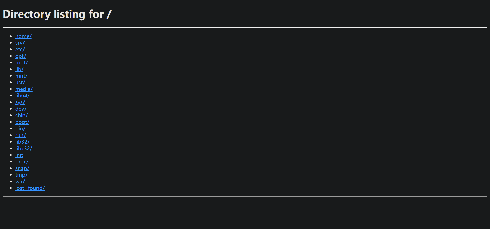

# mymuduo

> **一个模仿 muduo 设计思路所实现的 C++ 网络库**

## Introduction

根据 《Linux多线程服务端编程 使用muduo C++网络库》 by 陈硕 这本书的第8章：*"muduo 网络库的设计与实现"* 所讲述的设计思想，结合对源码的理解，从头开始实现的基于Reactor的网络编程库，基本上每个文件都进行了较详细的注释。
同时，在实现 HTTP 1.1 协议的基础上，参考 Python3 http.server 文件服务器实现了一个能够浏览本地文件并下载的 [WebServer](mymuduo/http/FileServer.h)

## Traits

- IO多路复用（Poll/EPoll Level 触发），基于 Reactor 模型，主线程可以通过 wakeup_fd 异步唤醒
- 多线程/线程池
- 定时器/定时器队列，使用 timerfd 来统一管理
- 同步/异步日志（照搬 muduo，有详细注释）
- Tcp Client/Server
- Http Server / File Server，能够解析 Http 请求，并且实现了一个本地文件服务器

## Build

在根目录下执行

```shell
./build.sh
```

对项目进行构建，会在项目当前路径下新建 build 文件夹。

## Install

在根目录下执行

```shell
./install # 执行时需要使用 sodu，键入密码即可
```

将头文件部署到 ```/usr/include/mymuduo```；
将静态库文件部署到 ```/usr/local/lib```。

## WebServer

运行 FileServer 的示例文件为 [FileServer_test.cc](./mymuduo/http/tests/FileServer_test.cc)，它默认将系统根目录 "/" 作为程序展示的根目录。项目构建成功后，可执行文件的位置如下：

```shell
项目根目录/build/bin/fileserver_test
```

可以在任意路径下执行该文件，比如在项目根目录下执行

```shell
./build/bin/fileserver_test
```

然后在浏览器中访问 localhost:8888，可以看到如下界面



## Design

设计思路内容较多，可以单独浏览 [DESIGN.md](DESIGN.md)

HTTP 部分的实现思路还有待上传，不过这部分在了解 Tcp 实现之后就很容易看懂源码了，注释比较详细。

## TODO

- [ ] 文件服务器目前只实现了内容的显示，文件下载部分因为想要支持 range 字段（常用于在线观看视频文件），还在实现中
- [ ] 后续可能会实现诸如 FTP 这类协议
