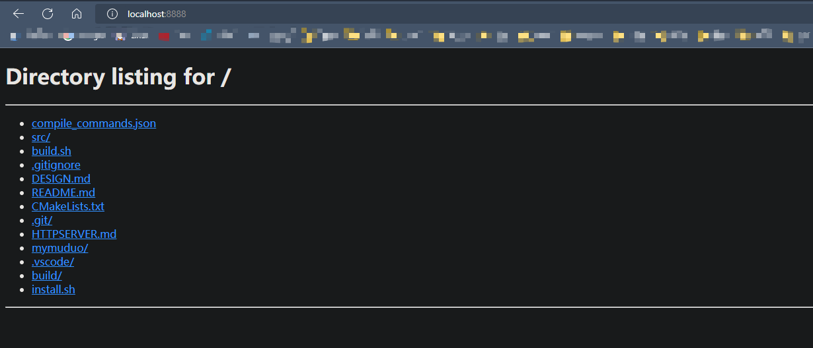
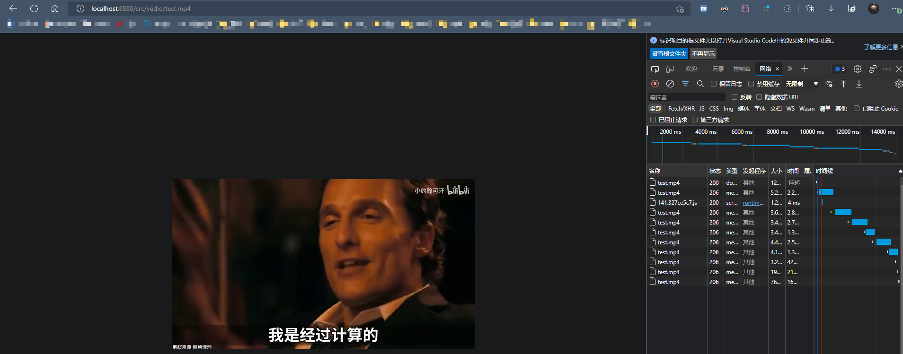

# mymuduo - FileServer

> **一个参考 muduo 设计思路所实现的 C++ 网络库以及 文件服务器**

## Introduction

根据 《Linux多线程服务端编程 使用muduo C++网络库》 by 陈硕 这本书的第8章：*"muduo 网络库的设计与实现"* 所讲述的设计思想，结合对源码的理解，从头开始实现的基于 Reactor 的网络编程库，基本上每个文件都进行了较详细的注释。
同时，在实现 HTTP 1.1 协议的基础上，参考 Python3 http.server 文件服务器实现了一个 [FileServer](mymuduo/http/FileServer.h)，可以浏览目录内容、查看文本或图片、传输大文件、在线浏览视频（可以拖动进度条）

## Traits

- IO多路复用（Poll / EPoll Level 触发），基于 Reactor 模型，主线程可以通过 wakeup_fd 异步唤醒
- 多线程/线程池
- 定时器/定时器队列，使用 timerfd 来统一管理
- 同步/异步日志（照搬 muduo，有详细注释）
- Tcp Client / Server
- Http Server / File Server，能够解析 Http 请求，并且实现了一个本地文件服务器，支持解析 range 头部，支持断点续传，使用 sendfile 传输大文件提高性能

## Build

在根目录下执行

```shell
./build.sh
```

对项目进行构建，会在项目当前路径下新建 build 文件夹，其中样例的可执行文件在 build/bin 下。

## Install

在根目录下执行

```shell
./install # 执行时需要使用 sodu，键入密码即可
```

将头文件部署到 ```/usr/include/mymuduo```；
将静态库文件部署到 ```/usr/local/lib```，
然后就可以进行自由开发啦。

## WebServer

运行 FileServer 的示例文件为 [FileServer_test.cc](./mymuduo/http/tests/FileServer_test.cc)，它默认将当前目录 "." 作为程序展示的根目录。项目构建成功后，可执行文件的位置如下：

```shell
build/bin/fileserver_test
```

可以在任意路径下执行该文件，比如在项目根目录下执行

```shell
./build/bin/fileserver_test
```

然后在浏览器中访问 localhost:8888，可以看到如下界面



还可以观看视频哦，支持拖动进度条(通过范围传输实现)



## Design

设计思路主要是按照 muduo 的实现，内容较多，可以单独浏览 [DESIGN.md](DESIGN.md)

HTTP 部分的实现思路还有待上传，不过这部分在了解 Tcp 实现之后就很容易看懂源码了，注释比较详细。

## TODO

- [x] ~~文件服务器目前只实现了内容的显示，文件下载部分因为想要支持 range 字段（常用于在线观看视频文件），还在实现中~~
- [ ] 后续可能会实现诸如 FTP 这类协议
